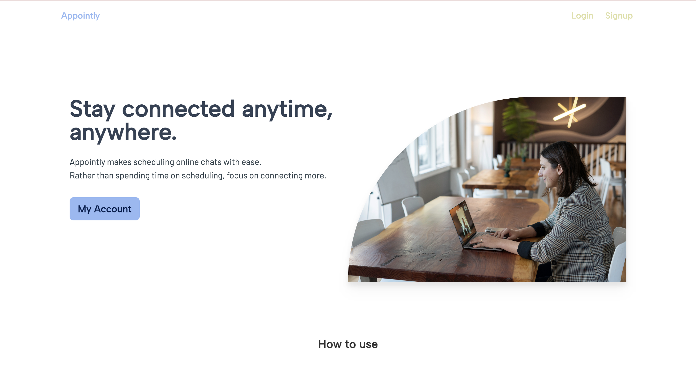
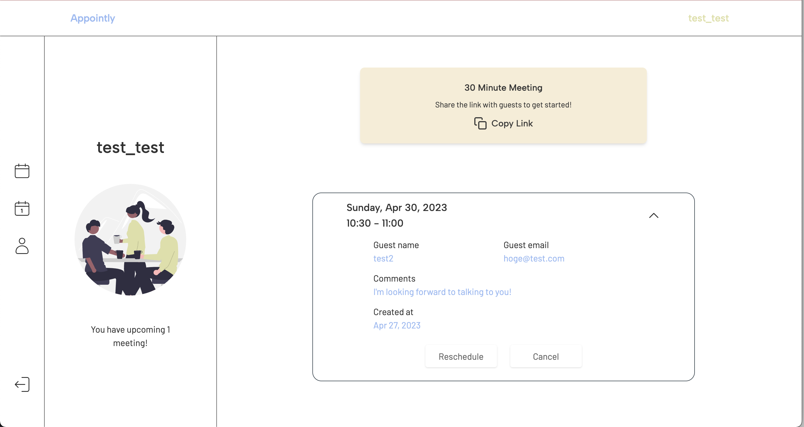
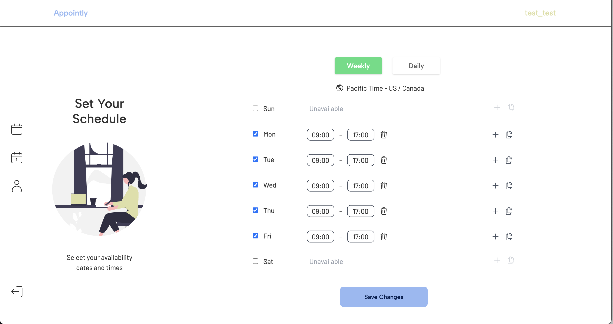
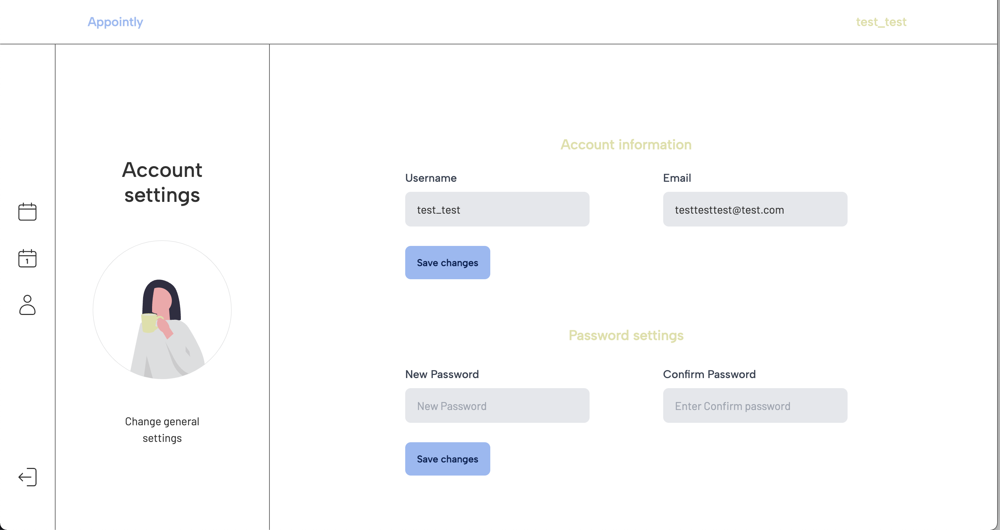
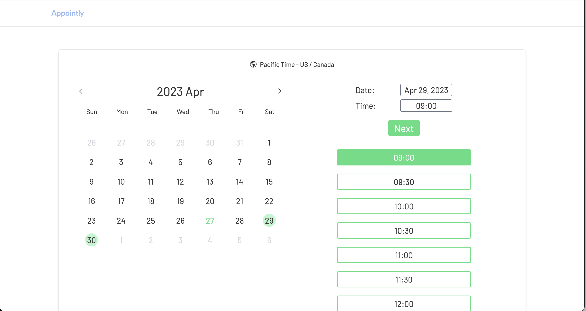
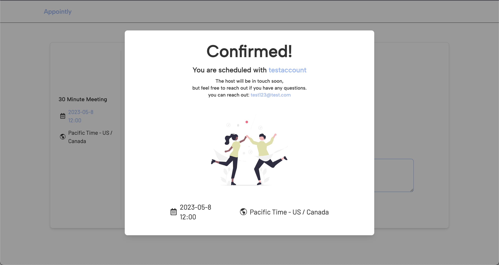

# Appointly

MERN stack application that allows users to create and share customizable calendar availability with others, enabling them to book appointments, meetings, and events at pre-scheduled times.

## Demo Link

[Appointly](https://appointly-mtg.vercel.app)

# Features

- You can set your availability slots on your personal page, and get a unique URL to share with your guests (Your guests do not need to create an account).
- When your guest schedules a meeting, both you and your guest will receive important information such as their name, email address, and any messages they include. Additionally, you can easily manage your appointments by canceling or rescheduling them on your personal 'mypage'.

# Purpose

- Deepen understanding about React and React related libraries such as Redux toolkit and React Router
- Get used to team work with GitHub

# Built With

## client

- React(Vite)
- Redux (Redux Toolkit)
- React Router
- Redux persist
- React Query
- Axios
- Moment.js
- Email.js
- Framer-motion
- react-router-hash-link
- Tailwind.css
- Daisy UI
- Vercel

## server

- Node.js
- Express.js
- Mongo DB
- Mongoose
- bcrypt
- JSON Web Token
- bson
- render

# Screen shots

### Landing page



### Host pages





### Guest pages




# How to install

All instructions should be done in the root directory.

1. Install concurrently for running multiple commands.

```
npm i concurrently
```

2. Install node_modules for both client and server.

```
npm run install-all
```

This might take a few minutes.

3. Run the app.

```
npm start
```
